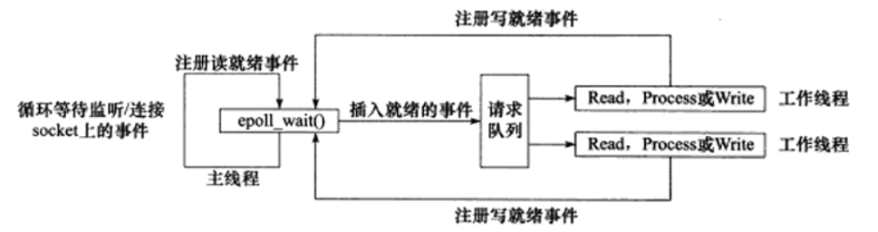

# springsnail
## 项目介绍
springsnail 是《Linux 高性能服务器编程》（游双） 附带的项目。该项目实现的是一个负载均衡服务器，核心是一个进程池，采用半同步/半异步（并非严格意义上的半同步/半异步）的并发模式。


## 技术细节
- 进程池的实现  
  进程池采用单例模式，通过 ```processpool：：create(int listenfd, int process_number)``` 函数创建，其构造函数被声明为私有的。```create()``` 函数需要传入一个 listen socket，并将其赋值给 ```processpool``` 类的静态变量 ```m_listenfd```。这么做的目的是使得父进程和每个子进程都共享同一个 listen socket，子进程可以方便地通过 accept 创建连接。  
  工作进程是主进程的子进程，主进程与工作进程之间通过管道进行通讯。每到收到一个新客户的连接请求，主进程会通知最闲的子进程来创建、管理连接并负责处理这一连接的事物。而子进程则把它的活跃连接数告知父进程，从而使得父进程能够合理分配负载。

- 为什么项目中实现的进程池并非严格意义上的半同步/半异步并发模式？  
  工作进程是异步线程，工作进程的执行需要由系统事件来驱动。工作线程需要调用 ```epoll_wait()``` 函数监听来自以下文件描述符的事件: client socket、server socket、与父进程通讯的管道 socket、信号通知 socket。

- 是否涉及同步互斥？是否需要锁？  
  与半同步/半反应堆方式（半同步/半异步方式的一种）不同，主进程直接把连接 socket 定向交付给子进程，而不是把它放到一个公共队列中，所以不需要借助同步互斥的机制。

- 负载均衡的实现  
  每一个工作线程都会创建一个连接管理类 ```mgr``` 对象，这个对象保存和记录：未使用的连接（与服务器的连接）、释放的连接（与服务器的连接）和正在使用的连接（与服务器的连接和与客户端的连接）。工作线程在每一次连接发生变化（正在使用的连接数量发生变化）的时候通知主进程自己的负载状况。主进程记录每个工作进程的负载状况，在分配连接 socket 的时候首先通知负载最低的工作进程。 

- 三组 I/O 复用函数的比较 -- select、poll、epoll
  ```c
  #include<sys/select.h>
  select(int nfds, fd_set* readfds, fd_set* writefds, fd_set* exceptfds, struct timeval* timeout);
  ```
  ```c
  #include<sys/poll.h>
  int poll(struct pollfd* fds, nfds_t nfds, int timeout);
  ```
  ```c
  #include<sys/epoll.h>
  int epoll_create(int size);
  int epoll_ctl(int epfd, int op, int fd, struct epoll_event * event);
  int epoll_wait(int epfd, struct epoll_event* events, int maxevents, int timeout);
  ```
  - 事件集合  
    1. select 通过三个参数分别传入感兴趣的可读、可写及异常事件，内核通过对这些参数的在线修改来反馈就绪事件，这使得用户每次调用 select 都需要重置这三个参数  
    2. poll 统一处理所有事件，只有一个事件集参数。用户通过参数结构体的一个成员传入感兴趣的事件，内核通过另一个成员反馈其中的就绪事件  
    3. epoll 内核通过一个事件表管理用户感兴趣的所有事件，所以无需反复传入感兴趣的事件，epoll_wait 用一个参数来反馈就绪事件  
  - 具体实现  
    select 和 poll 采用轮询的方式，应用程序索引就绪文件描述符的时间复杂度为 O(n)，epoll 采用回调的方式，复杂度是 O(1)
  - 工作模式  
    select 和 poll 采用的工作模式是 LT（应用程序可以不立即处理该事件，如果不处理，后续还会再通知该事件），epoll 采用的工作模式是 ET（应用程序必须立即处理该事件，后续不再通知）
  - 最大支持文件描述符  
    select 一般有最大值限制， poll 和 epoll 都是 65535

## 基本概念
- I/O 模型  
  |I/O模型|读写操作和阻塞阶段|
  |---|---|
  |阻塞IO|程序阻塞于读写函数 connect、accept、send、recv|
  |I/O复用|程序阻塞于I/O复用系统调用，但可以同时监听多个I/O事件。对于I/O本身的读写操作是非阻塞的|
  |SIGIO信号|信号触发读写就绪事件，用户程序执行读写操作。程序没有阻塞阶段|
  |异步IO|内核执行读写操作并触发读写完成事件。程序没有阻塞阶段|
  
  前三种都是同步IO，因为I/O读写操作都是在I/O事件发生之后由应用程序来完成的。最后一种是异步IO，I/O操作由内核执行。    
  同步I/O向应用程序通知的是I/O就绪事件，异步I/O向应用程序通知的是I/O完成事件。  

- 事件处理模型  
  - Reactor 是非阻塞同步网络模式，感知的是就绪可读写事件 

    

  - Proactor 是异步网络模式， 感知的是已完成的读写事件

- 并发模型  
  - 半同步/半异步  
    异步线程处理 I/O 事件，同步线程处理客户逻辑
  - 领导者/追随者

## 安装及使用
- 下载源码
  ```shell
  $ git clone https://github.com/YaoweiFan/springsnail.git
  ```
- 编译项目
  ```shell
  $ cd springsnail
  $ make
  ```

- 填写配置文件 ```config.xml```  
  - 查看百度服务器的ip地址
    ```shell
    $ nslookup baidu.com
    Server:		127.0.0.53
    Address:	127.0.0.53#53

    Non-authoritative answer:
    Name:	baidu.com
    Address: 220.181.38.251
    Name:	baidu.com
    Address: 220.181.38.148
    ```
  - 配置文件中 logical_host 的 name 填写上面解析出来的两个 ip 地址
    ```xml
    Listen 127.0.0.1:8080

    <logical_host>
      <name>220.181.38.251</name>
      <port>80</port>
      <conns>2</conns>
    </logical_host>
    <logical_host>
      <name>220.181.38.148</name>
      <port>80</port>
      <conns>2</conns>
    </logical_host>
    ```
    第一行是负载均衡服务器的地址，下面两个则是真正的服务器，`spingsnail`只是起到一个中转站的作用，将客户端的连接转发给比较“闲”的服务器

- 运行程序，开启负载均衡服务器
  ```shell
  $ ./springsnail -f config.xml
  ```

- 连接负载均衡服务器
  ```shell
  $ nc localhost 8080
  GET / HTTP/1.1
  Host: baidu.com

  ```